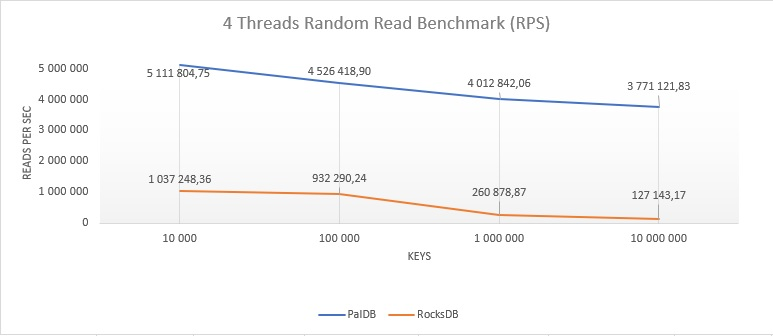
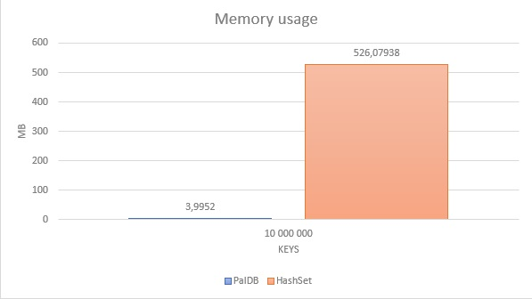

PalDB
==========
[](https://maven-badges.herokuapp.com/maven-central/net.soundvibe/paldb)
[](https://travis-ci.org/soundvibe/PalDB)
[](https://codecov.io/gh/soundvibe/PalDB)

PalDB is an embeddable write-once key-value store written in Java.

What is PalDB?
-------------------

PalDB is an embeddable persistent key-value store with very fast read performance and compact store size. PalDB stores are single binary files.

PalDB's JAR is only 65K and has a single dependency (snappy, which isn't mandatory). It's also very easy to use with just a few configuration parameters.

**This is separate evolution of original PalDB.**

Improvements from PalDB 1.0.2
-------------------
- New StoreRW interface for reading and writing. It is fully thread-safe and makes no sacrifices on performance.
- StoreReader is now fully thread-safe without any performance decrease.
- StoreReader and StoreWriter can be used with generics (StoreReader<K<V> and StoreWriter<K,V>)
- Typesafe ``PalDBConfigBuilder`` for easier configuration
- There are no limits on how many keys you can store
- Duplicates could be optionally allowed
- Bloom filters could be enabled for even better read performance in some cases

Performance
-----------

PalDB is significantly less complex than other embeddable key-value stores and therefore allows a compact storage format and very high throughput. PalDB is specifically optimized for fast read performance and compact store sizes. Performances can be compared to in-memory data structures such as Java collections (e.g. HashMap, HashSet) or other key-values stores (e.g. LevelDB, RocksDB).

Current benchmark on a 3.1Ghz Macbook Pro with 10M integer keys index shows an average performance of ~1.6M reads/s for a memory usage 6X less than using a traditional HashSet. That is 5X faster throughput compared to LevelDB (1.8) or RocksDB (4.0).

Results of a multithreaded throughput benchmark between PalDB and RocksDB (higher is better):



Memory usage benchmark between PalDB and a Java HashSet (lower is better):



What is it suitable for?
------------------------
PalDB can be used for caching [Kafka](https://kafka.apache.org/) compacted topics. It will perform key lookups very efficiently by using very little memory and storing database file on disk.

Side data can be defined as the extra read-only data needed by a process to do its job. For instance, a list of stopwords used by a natural language processing algorithm is side data. Machine learning models used in machine translation, content classification or spam detection are also side data. When this side data becomes large it can rapidly be a bottleneck for applications depending on them. PalDB aims to fill this gap.

PalDB can replace the usage of in-memory data structures to store this side data with comparable query performances and by using an order of magnitude less memory. It also greatly simplifies the code needed to operate this side data as PalDB stores are single binary files, manipulated with a very simple API (see below for examples).

Code samples
------------

API documentation can be found [here](http://linkedin.github.com/PalDB/doc/javadoc/index.html).
How to use RW store
```java
try (var palDB = PalDB.<Integer,String>createRW(new File("store.paldb"))) {
    palDB.open();
    palDB.put(1213, "foo");
    var value = palDB.get(1213);
}
```


How to write a store
```java
try (var writer = PalDB.<Integer,String>createWriter(new File("store.paldb"))) {
    writer.put(1213, "foo");
}
```

How to read a store
```java
try (var reader = PalDB.<Integer,String>createReader(new File("store.paldb"))) {
    String val = reader.get(1213);
}
```

How to iterate on a store
```java
try (var reader = PalDB.<Integer,String>createReader(new File("store.paldb"))) {
    for (var entry : reader) {
      Integer key = entry.getKey();
      String value = entry.getValue();
    }
}
```

For Scala examples, see [here](https://gist.github.com/mbastian/9b9b49a4b96333da33ec) and [here](https://gist.github.com/mbastian/440a706f5e863bb65622).

Use it
------

PalDB is available on Maven Central, hence just add the following dependency:
```
<dependency>
    <groupId>net.soundvibe</groupId>
    <artifactId>paldb</artifactId>
    <version>2.1.0</version>
</dependency>
```
Scala SBT
```
libraryDependencies += "net.soundvibe" % "paldb" % "2.1.0"
```


Frequently asked questions
--------------------------

**Can you open a store for writing subsequent times?**

Yes, you can use `StoreRW` for that.

**Are duplicate keys allowed?**

Duplicates are not allowed by default. But it could be changed in writer configuration if needed.

**Do keys have an order when iterating?**

No, like a hashtable PalDB stores have no order.

Build
-----

PalDB requires Java 13+ and maven. The target Java version is 13.

```bash
mvn build
```

Performance tests are run separately from the build
```bash
mvn clean test -Dtag=performance
```

Test
----

We use the JUnit5 framework for our unit tests. You can run them via the `mvn clean test` command.

Coverage
--------

Coverage is run using JaCoCo. You can run a report via `mvn jacoco:report`. The report will be generated in `paldb/build/reports/jacoco/test/html/`.

Advanced configuration
----------------------

Write parameters:

+ `load.factor`,  index load factor (double) [default: 0.75]
+ `compression.enabled`, enable compression (boolean) [default: false]
+ `bloom.filter.enabled`, enable bloom filter (boolean) [default: false]
+ `bloom.filter.error.factor`, bloom filter error rate  (double) [default: 0.01]
+ `duplicates.enabled`, allow duplicates  (boolean) [default: false]
+ `write.buffer.size`, Number of elements to hold in write buffer before compaction occurs  (int) [default: 100000]
+ `write.auto.flush.enabled`, Enable writer auto flush  (boolean) [default: true]

Read parameters:

+ `mmap.data.enabled`, enable memory mapping for data (boolean) [default: true]
+ `mmap.segment.size`, memory map segment size (bytes) [default: 1GB]

Configuration values are passed at init time. Example using fluent builder:
```java
var config = PalDBConfigBuilder.create()
                .withMemoryMapSegmentSize(512 * 1024 * 1024)
                .withMemoryMapDataEnabled(false)
                .withIndexLoadFactor(0.75)
                .withEnableCompression(true)
                .withEnableBloomFilter(true)
                .build();
StoreReader<String,String> reader = PalDB.createReader(new File("store.paldb"), config);
```

A few tips on how configuration can affect performance:

+ Disabling memory mapping will significantly reduce performance as disk seeks will be performed instead.
+ Enabling the bloom filter makes sense when you expect to miss finding some values. It will greatly increase read performance in this case.
+ Compression can be enabled when the store size is a concern and the values are large (e.g. a sparse matrix). By default, PalDB already uses a compact serialization. Snappy is used for compression.
+ StoreRW is not optimized for putting huge amounts of entries after `init()` is completed. Keeping `write.buffer.size` large will reduce flush times significantly with a cost of increased memory usage.

Custom serializer
-----------------

PalDB is primarily optimized for Java primitives and arrays but supports adding custom serializers so arbitrary Java classes can be supported.

Serializers can be defined by implementing the `Serializer` interface and its methods. Here's an example which supports the `java.awt.Point` class:

```java
public class PointSerializer implements Serializer<Point> {

  @Override
  public Point read(DataInput input) {
    return new Point(input.readInt(), input.readInt());
  }

  @Override
  public void write(DataOutput output, Point point) {
    output.writeInt(point.x);
    output.writeInt(point.y);
  }
  
  @Override
  public Class<Point> serializedClass() {
    return Point.class;
  }
}
```

The `write` method serializes the instance to the `DataOutput`. The `read` method deserializes from `DataInput` and creates new object instances.

Serializer implementation should be registered using the `Configuration`:

```java
var configuration = PalDB.newConfiguration();
configuration.registerSerializer(new PointSerializer());
```

Use cases
---------

At LinkedIn, PalDB is used in analytics workflows and machine-learning applications.

Its usage is especially popular in Hadoop workflows because memory is rare yet critical to speed things up. In this context, PalDB often enables map-side operations (e.g. join) which wouldn't be possible with classic in-memory data structures (e.g Java collections). For instance, a set of 35M member ids would only use ~290M of memory with PalDB versus ~1.8GB with a traditional Java HashSet. Moreover, as PalDB's store files are single binary files it is easy to package and use with Hadoop's distributed cache mechanism.

Machine-learning applications often have complex binary model files created in the `training` phase and used in the `scoring` phase. These two phases always happen at different times and often in different environments. For instance, the training phase happens on Hadoop or Spark and the scoring phase in a real-time service. PalDB makes this process easier and more efficient by reducing the need of large CSV files loaded in memory.

Limitations
-----------
+ PalDB is optimal in replacing the usage of large in-memory data storage but still use memory (off-heap, yet much less) to do its job. Disabling memory mapping and relying on seeks is possible but is not what PalDB has been optimized for.

Contributions
-----------

Any helpful feedback is more than welcome. This includes feature requests, bug reports, pull requests, constructive feedback, etc.

Copyright & License
-------------------

PalDB © 2019 Linas Naginionis. Licensed under the terms of the Apache License, Version 2.0.
PalDB © 2015 LinkedIn Corp. Licensed under the terms of the Apache License, Version 2.0.
